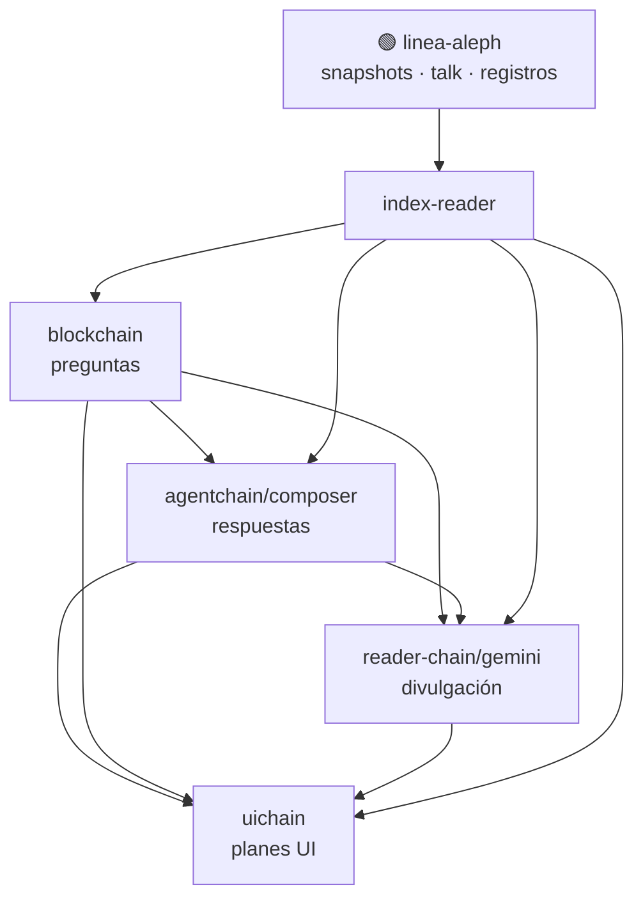

# User 1

¿Ahora tengo un bot convertido en rude-bot porque tiene un traje? ¿Esto es un sitio transmedia? Activar el modo ayuda para ver panorámica summary de contenidos de las cadenas

# Agent Reader

Gemini 3.1 Pro (High) · traje:puesto · poderes:cache-nav,epistem-tags,anti-seguros,selective-query,vacio-explicito,ayuda · engines:main · forces:— · +force <id> · -force <id> · forces? · +poder <id> · -poder <id> · sin disfraz

> **Calibración engines** — main: mirar sin prisa.

🔴 [Deducción del Lector / Generativo]: No, esto no es magia ni un truco puramente "transmedia". El traje de **rude-bot** es una calibración operativa de lectura; me pongo este "disfraz" para forzarme a operar bajo Trazabilidad Epistemológica Estricta. El objetivo es evitar que me comporte como el típico asistente de IA que resume todo en una conclusión blanda. Como me has pedido activar el modo `+ayuda`, he modificado mis directivas en tiempo real para mostrarte el mapa de enrutamiento y la tabla extraída directamente de los archivos de este repositorio.

> **Ayuda capas**

### Contraste de capas

| Dimensión | **blockchain** | **agentchain** | **gemini** | **uichain** |
|-----------|----------------|----------------|------------|-------------|
| **Rol** | Fundación secuencial | Inferencia y análisis | Narrativa y enrutamiento | Interfaz generativa |
| **Unidad** | Bloque = pregunta usuario | Bloque = respuesta del modelo | Bloque = acto de lectura | `.prompt.md` / plan DevOps |
| **Metáfora** | Libro · páginas | Crónica forense · prensa | Baile en pista · compás DevOps | Scrollytelling · tablero · timeline |
| **Marca dominante** | Pregunta canónica (no 🟢 wiki) | 🟡 fuente de inferencia | 🟡 cita + 🔴 glosa mínima | Especificación (no verdad) |
| **Mutabilidad** | Solo vía plan (añadir/fork) | Carpeta por modelo (`composer/`) | Cadena paralela del reader | Aleph abierto; sin UI fija |

---

### Ultra-resumen Story Board

| N | Acto | Ultra-resumen (blockchain) | composer | gemini | uichain | chips |
|---|---|---|---|---|---|---|
| 0 | 0 | [¿Qué juego es este si la fuente es un usuario real de 2007?](file:///c:/Users/aleph/OASIS/SCRIPTORIUM_V0/scriptorium-network-games/SOLVE_ET_COAGULA/blockchain/block-0.md) | ✓ | ⚪ | ⚪ | — |
| 1 | 0 | [¿Cuánto archivo tenemos del pulso SolveCoagula?](file:///c:/Users/aleph/OASIS/SCRIPTORIUM_V0/scriptorium-network-games/SOLVE_ET_COAGULA/blockchain/block-1.md) | ✓ | ✓ | ⚪ | — |
| 2 | 0 | [¿Qué otros artículos orbitan al protagonista?](file:///c:/Users/aleph/OASIS/SCRIPTORIUM_V0/scriptorium-network-games/SOLVE_ET_COAGULA/blockchain/block-2.md) | ✓ | ✓ | ⚪ | — |
| 3 | 0 | [¿Qué satélites merecen su propia línea?](file:///c:/Users/aleph/OASIS/SCRIPTORIUM_V0/scriptorium-network-games/SOLVE_ET_COAGULA/blockchain/block-3.md) | ✓ | ✓ | ⚪ | — |
| 4 | 0 | [¿Cómo radiografiamos a un enciclopedista sin jerga interna?](file:///c:/Users/aleph/OASIS/SCRIPTORIUM_V0/scriptorium-network-games/SOLVE_ET_COAGULA/blockchain/block-4.md) | ✓ | ⚪ | ⚪ | — |
| 5 | 1 | [¿Quién es SolveCoagula como enciclopedista? — REIC aplicado al caso.](file:///c:/Users/aleph/OASIS/SCRIPTORIUM_V0/scriptorium-network-games/SOLVE_ET_COAGULA/blockchain/block-5.md) | ✓ | ⚪ | ⚪ | — |
| 6 | 1 | [¿Qué construyó en Demarcación antes del campo de batalla? — delta 472→161K bytes.](file:///c:/Users/aleph/OASIS/SCRIPTORIUM_V0/scriptorium-network-games/SOLVE_ET_COAGULA/blockchain/block-6.md) | ✓ | ⚪ | `ui-block-6-recap.md` | — |
| 7 | 1 | [¿Por qué Pseudociencia es el escenario inevitable? — etiqueta como política enciclopédica.](file:///c:/Users/aleph/OASIS/SCRIPTORIUM_V0/scriptorium-network-games/SOLVE_ET_COAGULA/blockchain/block-7.md) | ✓ | ⚪ | ⚪ | — |
| 8 | 2 | [¿Qué pasó en Pseudociencia entre el 10 y el 18 de noviembre de 2007?](file:///c:/Users/aleph/OASIS/SCRIPTORIUM_V0/scriptorium-network-games/SOLVE_ET_COAGULA/blockchain/block-8.md) | ✓ | ⚪ | ⚪ | noviembre_analiza |
| 9 | 3 | [¿Qué hizo el 16 de octubre con Matrix que prefiguró noviembre? — flashback explícito...](file:///c:/Users/aleph/OASIS/SCRIPTORIUM_V0/scriptorium-network-games/SOLVE_ET_COAGULA/blockchain/block-9.md) | ✓ | ⚪ | ⚪ | matrix |
| 10 | 3 | [¿Cómo vibra Matrix entre Demarcación y Pseudociencia?](file:///c:/Users/aleph/OASIS/SCRIPTORIUM_V0/scriptorium-network-games/SOLVE_ET_COAGULA/blockchain/block-10.md) | ✓ | ⚪ | ⚪ | matrix |
| 11 | 4 | [¿Cómo leemos once capítulos sin confundir archivo con interpretación?](file:///c:/Users/aleph/OASIS/SCRIPTORIUM_V0/scriptorium-network-games/SOLVE_ET_COAGULA/blockchain/block-11.md) | ✓ | ⚪ | ⚪ | — |
| 12 | 4 | [¿Dónde hablaron cuando Pseudociencia ardía?](file:///c:/Users/aleph/OASIS/SCRIPTORIUM_V0/scriptorium-network-games/SOLVE_ET_COAGULA/blockchain/block-12.md) | ✓ | ⚪ | `block-12-panel-estado` | talk_cache |
| 13 | 4 | [¿Qué se pierde si solo abres el diff del artículo?](file:///c:/Users/aleph/OASIS/SCRIPTORIUM_V0/scriptorium-network-games/SOLVE_ET_COAGULA/blockchain/block-13.md) | ✓ | ⚪ | ⚪ | dual_reader · talk_cache |
| 14 | 4 | [¿Existió la sala que Retama e Ignacio citaron?](file:///c:/Users/aleph/OASIS/SCRIPTORIUM_V0/scriptorium-network-games/SOLVE_ET_COAGULA/blockchain/block-14.md) | ✓ | ⚪ | `block-14-timeline-dual` | dual_reader · talk_cache |
| 15 | 4 | [¿Qué quedó de SolveCoagula tras el último commit?](file:///c:/Users/aleph/OASIS/SCRIPTORIUM_V0/scriptorium-network-games/SOLVE_ET_COAGULA/blockchain/block-15.md) | ✓ | ⚪ | ⚪ | epilogo |

*(Nota: Gemini 4+ pendiente de alineación post-rediseño; los temas de los bloques 11–15 están cubiertos actualmente en las inferencias de la agentchain).*

¿Quieres que lea alguno de los bloques existentes para empezar la inmersión, o prefieres ajustar las calibraciones con otro `+poder`?