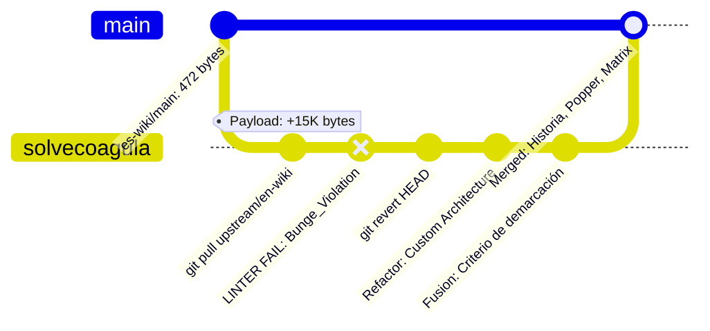

# User 3

Haznos la épica de alguien que debe estar un poco cansado por el esfuerzo de traducción al inglés. Un poco, perdona chicos yo solo traigo lo que dice el mundo anglo. ¿Por qué le atacan? ¿Cómo discrepan la española y qué concesiones y qué resiste en el nuevo plan desde 0?
Recuerda que somos gente FOSS y devops (a la hora de elegir vocabulario y lore para el reader).

# Agent Reader

¡Saludos a toda la gente del hacklab! Qué bueno que estéis trasteando con esto en pantalla grande. 

Poneos cómodos, porque vamos a ver este suceso histórico no como una simple edición de enciclopedia, sino como lo que realmente fue: **un `Merge Conflict` monumental de proporciones epistemológicas entre el *upstream* anglosajón y un *fork* local muy opinionado**.

He montado una interfaz de terminal inmersiva para reconstruir esta épica del refactor. Desplegando visor de logs...

````carousel
<div align="center">
  <h2>🛑 INCIDENT REPORT: THE ANGLO PAYLOAD</h2>
  <p><em>Trace ID: 11951034-Demarcacion</em></p>
</div>

> **CONTEXTO DE LA OPERACIÓN:**
> 🟢 [Dato Wiki]: 10 de octubre de 2007. El artículo original sobre Demarcación pasaba hambre (apenas 472 bytes). 
> 🟡 [Inferencia Agentchain]: SolveCoagula decide hacer un *pull* masivo desde la rama `en.wikipedia.org/main` (la wiki en inglés). 

🔴 [Deducción del Lector]
*Imaginemos a SolveCoagula de madrugada, agotado tras parsear la sintaxis y traducir 15K de texto. Tira un commit enorme a producción pensando: "Chicos, tranquilos, ya os he traído la feature completa desde el repo principal. The Anglo world has spoken."*

Pero el *pipeline* cultural estalla en pedazos.

<!-- slide -->
<div align="center">
  <h2>🔥 THE LINTER ERROR: CULTURAL CLASH</h2>
</div>

¿Por qué le atacan? ¿Por qué la Wikipedia en español (el *fork* local) rechaza el *upstream*?

🔴 [Deducción del Lector]: 
El ecosistema español no es un mero espejo del mundo anglo. Tiene sus propias dependencias teóricas fuertemente cacheadas. 
El "mundo anglo" compila la filosofía de la ciencia usando el *framework* analítico (Popper, Kuhn, Lakatos) y tolera interfaces de anarquismo epistemológico como Feyerabend (que dice "no hay reglas estables"). 

🟡 [Inferencia Agentchain: `blockchain/block-8.md`]
Pero la comunidad española corre sobre un kernel distinto: el **Materialismo Sistémico de Mario Bunge**. Bunge exige definiciones duras, fronteras estrictas y un rechazo frontal a la ambigüedad. Para los *maintainers* locales (como el usuario Analiza), el *payload* anglosajón es visto como código malicioso que inyecta vulnerabilidades (relativismo) en el núcleo de seguridad conceptual.

<!-- slide -->
<div align="center">
  <h2>⏪ GIT REVERT HEAD: LA RETIRADA</h2>
</div>

🟢 [Dato Wiki]: SolveCoagula revierte su propio volcado masivo.

🔴 [Deducción del Lector]:
SolveCoagula mira los logs de error y se da cuenta: *"Vale, el monolito anglosajón no pasa nuestra CI/CD comunitaria. Si insisto, me van a banear la IP por troll."*

No tira la toalla. Entra en modo **Arquitecto DevOps**. Si no puede inyectar el código anglosajón completo, va a extraer las librerías útiles y a escribir una API personalizada (arquitectura desde cero) que la comunidad hispana pueda digerir.

<!-- slide -->
<div align="center">
  <h2>🏗️ REFACTORING FROM SCRATCH: EL NUEVO STACK</h2>
</div>

🟢 [Dato Wiki: `agentchain/composer/block-5.md`]
SolveCoagula fusiona el artículo con un módulo hermano (*Criterio de demarcación*) y despliega la nueva arquitectura:
`[Historia, Popper, Kuhn, Feyerabend, Matrix, falsacionismo]`

**LAS CONCESIONES Y LAS RESISTENCIAS:**

*   **Lo que cede (El *Deprecation*):** 🟡 [Inferencia Agentchain]: Se abandona el tono de la wiki inglesa de "aquí no hay consenso alguno". El relativismo extremo se purga para no alertar al antivirus bungeano local.
*   **Lo que resiste (El *Core* Inyectado):** 🟡 [Inferencia Agentchain]: Logra introducir a Popper, Kuhn y Feyerabend como módulos históricos válidos. Incluso inyecta un módulo de cultura pop (`Matrix`) para ilustrar el problema filosófico, saltándose la rigidez académica tradicional.

<!-- slide -->
<div align="center">
  <h2>📊 GIT GRAPH VISUALIZATION</h2>
</div>



🔴 [Deducción del Lector]:
Al final, SolveCoagula no impuso el *upstream* anglo por fuerza bruta, sino que hackeó el consenso diseñando un *wrapper* hispano que contenía el código funcional de la filosofía analítica.
````

**¿Cómo lo veis desde el sofá?** Si queréis que indaguemos más a fondo en algún *commit* en particular de estos usuarios o en los logs de la agentchain, mandadme la instrucción por terminal.
