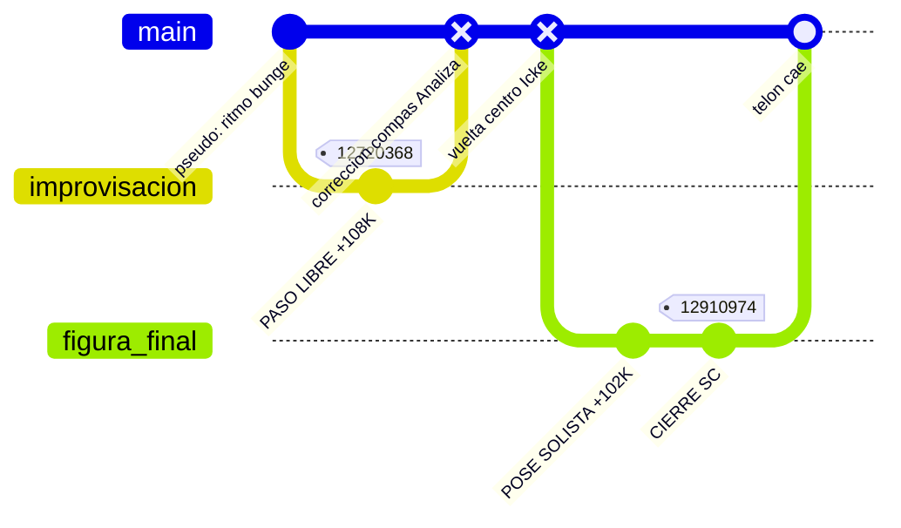

# User 4

El baile de noviembre: volcados, reverts y quién marca el último paso. Crónica para el sofá del hacklab — con marcadores epistemológicos y sin perderte en la geopolítica wiki.

# Agent Reader

¡Ey, equipo del hacklab! Después del *merge conflict* anglosajón del bloque 3, llegamos al **gran baile** de noviembre: alguien despliega ~109K de payload filosófico a *Pseudociencia*, dos compañeros de pista hacen `git revert`, y el autor original fuerza un `restore --force` antes de abandonar el salón para siempre.

Monté el visor de la **pista de baile** (tema bloque 8). Carrusel en marcha…

````carousel
<div align="center">
  <h2>📰 DESPACHO 5W — COREOGRAFÍA NOVIEMBRE</h2>
  <p><em>Ventana: 10–18 nov 2007 · Wikipedia en español</em></p>
</div>

| W | Respuesta |
|---|-----------|
| **Quién** | [SolveCoagula](https://es.wikipedia.org/wiki/Usuario:SolveCoagula) (improvisador); **Analiza** e **Ignacio_Icke** (marcadores de compás); la comunidad como orquesta |
| **Qué** | Tango sobre [Pseudociencia](https://es.wikipedia.org/wiki/Pseudociencia): coreografía heterodoxa, dos vueltas al centro ortodoxas, pose final |
| **Cuándo** | **10–18 nov 2007** — compás denso dentro del oct–nov ya descrito en bloque 7 |
| **Dónde** | Pista principal: *Pseudociencia*. Taller de ensayo (*Demarcación*) ya cerrado el 12 nov |
| **Por qué** | 🟡 [Inferencia Agentchain · `agentchain/composer/block-8.md`]: el compás de demarcación —sin consenso, con Lakatos, Feyerabend, holismo— desafía la coreografía bungeana estable en el artículo |

🟡 [Inferencia Agentchain · `agentchain/composer/block-8.md`]: Si el bloque 3 fue el ensayo cultural anglo vs. Bunge, este bloque es la **noche de gala**: los pasos ya compilaron; ahora se despliegan en la pista principal.

<!-- slide -->
<div align="center">
  <h2>📦 DEPLOY: PAYLOAD +108 874 BYTES</h2>
  <p><em>Trace ID: <a href="https://es.wikipedia.org/w/index.php?title=Pseudociencia&oldid=12720368">12720368</a>-Pseudociencia · 10 nov 2007 19:45</em></p>
</div>

> **CONTEXTO:**
> El ensayo (*Demarcación*) ha terminado. La pista de baile es ahora el artículo de **etiqueta negativa**.

🟢 [Dato Wiki · oldid 12720368](https://es.wikipedia.org/w/index.php?title=Pseudociencia&oldid=12720368): Volcado de SolveCoagula — **142 961 bytes**, delta **+108 874**.

🟢 [Dato Wiki]: La apertura cacheada ya no es un vals bungeano estricto. Cita a Lakatos, Feyerabend, holismo Quine-Duhem; la definición clásica pasa a ser «arbitraria, subjetiva y no consensuada».

🟡 [Inferencia Agentchain · `agentchain/composer/block-8.md`]: El núcleo demarcación fue un ensayo en solitario; *pseudociencia* es donde el ritmo se vuelve **coreografía enciclopédica obligatoria**.

🔴 [Deducción del Lector]: Es como irrumpir en un baile de salón y empezar un solo de danza contemporánea masivo. Sin coordinar con el elenco.

<!-- slide -->
<div align="center">
  <h2>🛡️ PASO ATRÁS #1 — CORRECCIÓN DE COMPÁS</h2>
  <p><em>Trace ID: <a href="https://es.wikipedia.org/w/index.php?title=Pseudociencia&oldid=12719652">12719652</a> · Analiza · 10 nov 19:18</em></p>
</div>

🟢 [Dato Wiki · oldid 12719652](https://es.wikipedia.org/w/index.php?title=Pseudociencia&oldid=12719652): **34 057 bytes**. Delta **−108 874**. Resumen: *«¿Vamos a dialogar o no? El artículo no cumple con PVN de esta forma»*.

🟢 [Dato Wiki]: La pista vuelve a Mario Bunge al frente, lista taxativa — sin el desgarro lakatosiano-feyerabendiano.

🟡 [Inferencia Agentchain · `agentchain/composer/block-8.md`]: **Analiza** en el elenco = marcador de ritmo ortodoxo; invoca **Políticas de Verificabilidad Neutral** como quien pide volver al vals base.

🟡 [Inferencia Agentchain · `agentchain/composer/block-13.md`]: El mismo día, en el vestuario (UT), el diálogo continúa — ver Gemini block-7.

<!-- slide -->
<div align="center">
  <h2>⏪ PASO ATRÁS #2 — CONSENSUS BRANCH</h2>
  <p><em>Trace ID: <a href="https://es.wikipedia.org/w/index.php?title=Pseudociencia&oldid=12909144">12909144</a> · Ignacio_Icke · 18 nov 2007 18:55</em></p>
</div>

Ocho días después de la irrupción, otro giro de vuelta en la pista.

🟢 [Dato Wiki · oldid 12909144](https://es.wikipedia.org/w/index.php?title=Pseudociencia&oldid=12909144): **33 598 bytes**. Delta **−102 467**. Resumen: *«revierto a versión consensuada (ver discusión»*.

🟢 [Dato Wiki]: Misma melodía que Analiza — apertura bungeana, Sokal-Bricmont.

🟡 [Inferencia Agentchain · `agentchain/composer/block-8.md`]: **Ignacio_Icke** = compañero que apela a la **figura consensuada** en la página de discusión.

🟡 [Inferencia Agentchain · `agentchain/composer/block-15.md`]: La sala citada no registra actividad en 2007 — «ver discusión» sin contrapartida recuperable en ese namespace.

<!-- slide -->
<div align="center">
  <h2>⚡ FIGURA DE CIERRE — RESTORE FINAL</h2>
  <p><em>Trace ID: <a href="https://es.wikipedia.org/w/index.php?title=Pseudociencia&oldid=12910974">12910974</a> · SolveCoagula · 18 nov 19:55</em></p>
</div>

Dos pasos finales en cadena: primero deshace la vuelta al centro de Ignacio_Icke (+102 467 bytes, resumen contra «VANDALISMO» entrecomillado en 🟢); luego cierra la sesión.

🟢 [Dato Wiki · oldid 12910974](https://es.wikipedia.org/w/index.php?title=Pseudociencia&oldid=12910974): Cierre del usuario — **136 054 bytes**. Apertura expansiva, demarcación sin consenso absoluto.

🟡 [Inferencia Agentchain · `agentchain/composer/block-8.md`]: Última figura en el histórico = compás heterodoxo del bailarín. No hay acuerdo sincronizado; hay una pose final espectacular antes del telón.

🔴 [Deducción del Lector]: En el mensaje de commit reclama que su danza tenía «más de 150 ediciones y más de 250 referencias». Cierra el baile abrazando su propia figura solista.

<!-- slide -->
<div align="center">
  <h2>👥 ELENCO — QUIÉN BAILA CON QUIÉN</h2>
</div>

| Usuario | Oldid hito | Delta | Señal del resumen |
|---------|------------|-------|-------------------|
| **Analiza** | [12719652](https://es.wikipedia.org/w/index.php?title=Pseudociencia&oldid=12719652) | −108 874 | Llama a coordinar pies (PVN) |
| **Ignacio_Icke** | [12909144](https://es.wikipedia.org/w/index.php?title=Pseudociencia&oldid=12909144) | −102 467 | Apela al compás del ensayo previo |
| **SolveCoagula** | [12910974](https://es.wikipedia.org/w/index.php?title=Pseudociencia&oldid=12910974) | cierre | Última figura impuesta antes de salir |
| **Retama** | [12806744](https://es.wikipedia.org/w/index.php?title=Usuario_discusión:Analiza&oldid=12806744) (talk) | — | Mediación en UT, no en artículo |

🟡 [Inferencia Agentchain · `agentchain/composer/block-8.md`]: Analiza = purista del ritmo clásico; Ignacio_Icke = guardián de la coreografía acordada; SolveCoagula = improvisador que traza su giro final contra el suelo liso.

🟢 [Dato Wiki · talk-cache · `agentchain/composer/block-13.md`]: **UT Analiza** y **UT SolveCoagula** registran diálogo el mismo día del revert [12719652](https://es.wikipedia.org/w/index.php?title=Pseudociencia&oldid=12719652): oldids talk [12719797](https://es.wikipedia.org/w/index.php?title=Usuario_discusión:Analiza&oldid=12719797), [12720101](https://es.wikipedia.org/w/index.php?title=Usuario_discusión:Analiza&oldid=12720101), [12720477](https://es.wikipedia.org/w/index.php?title=Usuario_discusión:Analiza&oldid=12720477) — alineación ±24 h, Δ 0,1–1,2 h.

⚪ [Blanco Explícito · estructural]: [Discusión:Pseudociencia](https://es.wikipedia.org/wiki/Discusión:Pseudociencia) = **0** revisiones en oct–nov 2007 (🟢 negativo, probe `talk-sala-probe` en `agentchain/composer/block-15.md`).

⚪ [Blanco Explícito · ventana]: **UT Ignacio_Icke** sin actividad en el pulso — primera UT recuperable **2010** (🟡 `agentchain/composer/block-15.md`).

<!-- slide -->
<div align="center">
  <h2>🏛️ CRÓNICA DEL SALÓN (SIN USERNAMES)</h2>
</div>

En la pista de baile pública, cuatro tiempos se cruzan:

1. **El improvisador** inyecta una secuencia vasta: el movimiento deja de ser un vals rígido para ser contorsión libre — Lakatos, Feyerabend, los límites de la cadencia lógica.

2. **El guardián del compás** responde con un giro centrípeto: restaura la figura básica de Bunge. La improvisación excesiva desequilibra el paso colectivo.

3. **El purista de la obra** repite la vuelta al centro ocho días después, apelando a la partitura.

4. **El solista** no negocia el tempo: deshace las correcciones de golpe. Ejecuta su figura más compleja y abandona la pista.

🟡 [Inferencia Agentchain · `agentchain/composer/block-8.md`]: Los pies dudan: ¿La pseudociencia puede bailarse sin partitura estricta? ¿Bunge es el ritmo metronómico o solo un paso a deconstruir?

<!-- slide -->
<div align="center">
  <h2>📊 GIT GRAPH — LA COREOGRAFÍA DE NOVIEMBRE</h2>
</div>



| Afirmación | Estado |
|------------|--------|
| Volcado 12720368 y reversos ±108K / −102K | 🟢 Validado |
| Analiza e Icke marcan el centro bungeano | 🟢 Validado |
| SolveCoagula cierra con pose solista en 12910974 | 🟢 Validado |
| Diálogo UT mismo día revert 12719652 (oldids talk) | 🟢 Validado (block-13) |
| Sala `Discusión:Pseudociencia` muda en 2007 | 🟢 Negativo (block-15) |
| Ensayo teórico → Despliegue en pista | 🟡 Inferido (bloque 7–8) |
| Intención privada en el compás | ⚪ No validable |

🔴 [Deducción del Lector]: Nadie «lidera» el vals del conocimiento para siempre. En este inmenso salón open-source, marca el compás final quien dibuja su última figura en el parqué antes de que se apague la música.
````

**¿Seguimos?** El vestuario (UT) tiene su propia coreografía en el bloque 7. También podemos abrir el módulo Matrix (bloque 5) o el recap del Acto I (bloque 6). Mandad instrucción por terminal.
