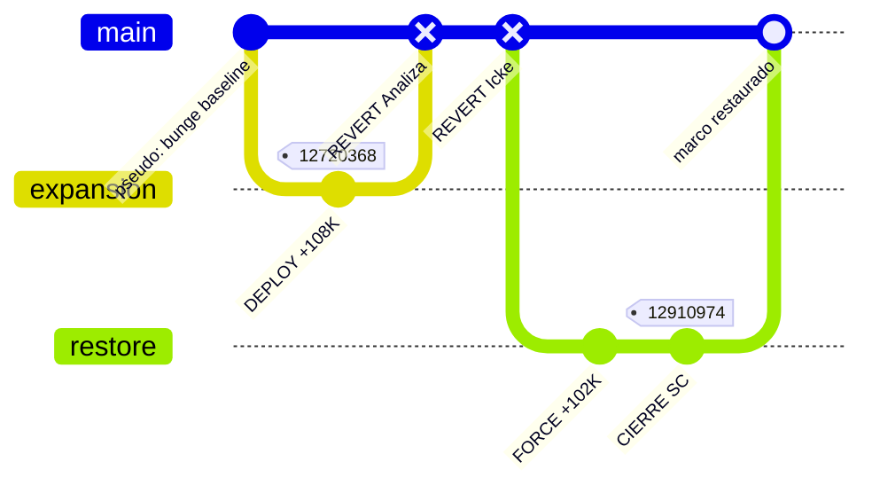

# User 4

La fricción de noviembre: volcados, reverts y quién gana el último byte. Crónica para el sofá del hacklab — con marcadores epistemológicos y sin perderte en la geopolítica wiki.

# Agent Reader

¡Ey, equipo del hacklab! Después del *merge conflict* anglosajón del bloque 3, llegamos al **incidente de producción** de noviembre: alguien despliega ~109K de payload filosófico a *Pseudociencia*, dos *maintainers* hacen `git revert`, y el autor original fuerza un restore antes de cerrar sesión para siempre.

Monté el visor de la **guerra de bytes** (tema bloque 8). Carrusel en marcha…

````carousel
<div align="center">
  <h2>📰 DESPACHO 5W — INCIDENTE PSEUDOCIENCIA</h2>
  <p><em>Ventana: 10–18 nov 2007 · Wikipedia en español</em></p>
</div>

| W | Respuesta |
|---|-----------|
| **Quién** | [SolveCoagula](https://es.wikipedia.org/wiki/Usuario:SolveCoagula) (constructor); **Analiza** e **Ignacio_Icke** (revertidores); la comunidad como tribunal implícito |
| **Qué** | Guerra de bytes sobre [Pseudociencia](https://es.wikipedia.org/wiki/Pseudociencia): volcado heterodoxo, dos reversiones ortodoxas, restauración final |
| **Cuándo** | **10–18 nov 2007** — pulso denso dentro del oct–nov ya descrito en bloque 7 |
| **Dónde** | Campo de aplicación: *Pseudociencia*. Taller teórico (*Demarcación*) ya cerrado el 12 nov |
| **Por qué** | 🟡 [Inferencia Agentchain · `agentchain/composer/block-8.md`]: el criterio de demarcación —sin consenso, con Lakatos, Feyerabend, holismo— desafía la definición bungeana estable en el artículo de etiqueta negativa |

🔴 [Deducción del Lector]: Si el bloque 3 fue el *linter* cultural anglo vs. Bunge, este bloque es el **segundo stage del pipeline**: la teoría ya compiló; ahora se despliega en el pod de producción que la gente lee cuando busca «qué es pseudociencia».

<!-- slide -->
<div align="center">
  <h2>📦 DEPLOY: PAYLOAD +108 874 BYTES</h2>
  <p><em>Trace ID: <a href="https://es.wikipedia.org/w/index.php?title=Pseudociencia&oldid=12720368">12720368</a>-Pseudociencia · 10 nov 2007 19:45</em></p>
</div>

> **CONTEXTO:**
> El taller teórico (*Demarcación*) ya cerró. El campo de batalla es el artículo de **etiqueta negativa**.

🟢 [Dato Wiki · oldid 12720368](https://es.wikipedia.org/w/index.php?title=Pseudociencia&oldid=12720368): Volcado de SolveCoagula — **142 961 bytes**, delta **+108 874**.

🟢 [Dato Wiki]: La apertura cacheada ya no es manual bungeano compacto. Cita a Lakatos contra Popper, Feyerabend, holismo Quine-Duhem; la definición bungeana pasa a ser «arbitraria, subjetiva y no consensuada».

🟡 [Inferencia Agentchain · `agentchain/composer/block-8.md`]: El núcleo demarcación funcionó como taller; *pseudociencia* es donde la teoría se vuelve **política enciclopédica** — qué etiquetas sobreviven, cuáles se cuestionan.

🔴 [Deducción del Lector]: Imaginad un `kubectl apply -f heterodoxia.yaml` sobre el pod `pseudociencia-prod` un viernes tarde. Sin canary. Sin feature flag. El *health check* de la comunidad aún no ha respondido.

<!-- slide -->
<div align="center">
  <h2>🛡️ REVERT #1 — PVN VIOLATION</h2>
  <p><em>Trace ID: <a href="https://es.wikipedia.org/w/index.php?title=Pseudociencia&oldid=12719652">12719652</a> · Analiza · 10 nov 19:18</em></p>
</div>

🟢 [Dato Wiki · oldid 12719652](https://es.wikipedia.org/w/index.php?title=Pseudociencia&oldid=12719652): **34 057 bytes**. Delta **−108 874**. Resumen: *«¿Vamos a dialogar o no? El artículo no cumple con PVN de esta forma»*.

🟢 [Dato Wiki]: El cuerpo vuelve a Mario Bunge al frente, lista taxativa de «macanas», tono de divulgación escéptica clásica — sin el bloque lakatosiano-feyerabendiano del volcado.

🟡 [Inferencia Agentchain · `agentchain/composer/block-8.md`]: **Analiza** en el elenco = guardián de norma editorial; no debate el diff línea a línea, invoca **Políticas de Verificabilidad Neutral** con tono de ultimátum.

🔴 [Deducción del Lector]: Es el equivalente a que CI falle por `lint-pvn` y el pipeline haga rollback automático al último commit «estable». El mensaje del commit es medio amenaza, medio invitación a negociar.

<!-- slide -->
<div align="center">
  <h2>⏪ REVERT #2 — CONSENSUS BRANCH</h2>
  <p><em>Trace ID: <a href="https://es.wikipedia.org/w/index.php?title=Pseudociencia&oldid=12909144">12909144</a> · Ignacio_Icke · 18 nov 2007 18:55</em></p>
</div>

Ocho días después del pulso del 10 de noviembre, otro revert.

🟢 [Dato Wiki · oldid 12909144](https://es.wikipedia.org/w/index.php?title=Pseudociencia&oldid=12909144): **33 598 bytes**. Delta **−102 467**. Resumen: *«revierto a versión consensuada (ver discusión»*.

🟢 [Dato Wiki]: Misma familia textual que Analiza — apertura bungeana, características de pseudociencias, Sokal-Bricmont contra relativismo — sin la apertura que niega consenso demarcatorio.

🟡 [Inferencia Agentchain · `agentchain/composer/block-8.md`]: **Ignacio_Icke** = revertidor que apela a **versión consensuada** en página de discusión; la disputa ya es política de comunidad, no solo diff.

🔴 [Deducción del Lector]: Segundo `git revert` sobre la misma rama conflictiva. Ya no es «este diff es malo»; es «volvé al branch que acordamos en el issue tracker».

<!-- slide -->
<div align="center">
  <h2>⚡ FORCE-RESTORE: ÚLTIMO BYTE</h2>
  <p><em>Trace ID: <a href="https://es.wikipedia.org/w/index.php?title=Pseudociencia&oldid=12910974">12910974</a> · SolveCoagula · 18 nov 19:55</em></p>
</div>

Dos pasos en cadena: primero deshace el revert de Ignacio_Icke (+102 467 bytes, resumen contra «VANDALISMO»); luego cierra.

🟢 [Dato Wiki · oldid 12910974](https://es.wikipedia.org/w/index.php?title=Pseudociencia&oldid=12910974): Cierre del usuario — **136 054 bytes**. Apertura con demarcación sin consenso, Bunge citado pero cuestionado, teoría de cuerdas como caso límite de pseudociencia.

🟡 [Inferencia Agentchain · `agentchain/composer/block-8.md`]: Última palabra en el histórico = marco heterodoxo del constructor. No hay merge request aceptado; hay **empate** con su snapshot final como estado de cierre.

🔴 [Deducción del Lector]: `git push --force` moral: reclama en el mensaje de commit que lo borrado eran «más de 150 ediciones y más de 250 referencias». No negocia párrafo a párrafo; deshace el undo entero.

<!-- slide -->
<div align="center">
  <h2>👥 ELENCO — QUIÉN HACE QUÉ EN PROD</h2>
</div>

| Usuario | Oldid hito | Delta | Señal del resumen |
|---------|------------|-------|-------------------|
| **Analiza** | [12719652](https://es.wikipedia.org/w/index.php?title=Pseudociencia&oldid=12719652) | −108 874 | PVN incumplido; ultimátum dialógico |
| **Ignacio_Icke** | [12909144](https://es.wikipedia.org/w/index.php?title=Pseudociencia&oldid=12909144) | −102 467 | «Versión consensuada»; apela a discusión |
| **SolveCoagula** | [12910974](https://es.wikipedia.org/w/index.php?title=Pseudociencia&oldid=12910974) | cierre | Última edición del usuario; marco restaurado |

🟡 [Inferencia Agentchain · `agentchain/composer/block-8.md`]: Analiza = custodio de manual + norma PVN; Ignacio_Icke = revertidor de consenso previo; SolveCoagula = constructor que reclama vandalismo cuando pierde el marco teórico.

⚪ [Blanco Explícito]: Motivaciones privadas, off-wiki o intención estratégica del trío — **DATO FALTANTE**; no validable desde `registro.md`.

<!-- slide -->
<div align="center">
  <h2>🏛️ CRÓNICA DE ARQUETIPOS (SIN USERNAMES)</h2>
</div>

En un archivo público de conocimiento, cuatro fuerzas se cruzan:

1. **El expansionista** inyecta payload teórico completo: la etiqueta deja de ser advertencia sanitaria y pasa a ser nodo de debate sin consenso — Lakatos, Popper, Feyerabend, holismo, límites de la lógica.

2. **El custodio de manual** responde con poda drástica: restaura la voz del epistemólogo sistemista, la lista de características y el tono escéptico. Para él, el payload no es «más filosofía» sino incumplimiento de norma de verificabilidad neutral.

3. **El revertidor de consenso** repite la poda ocho días después, invocando versión ya acordada en discusión — la disputa trasciende el diff y se vuelve política de comunidad.

4. **El restaurador** no negocia párrafo a párrafo: deshace el revert entero y reclama trabajo masivo con referencias. La tensión heterodoxia/ortodoxia no se resuelve; se **empata** con el marco heterodoxo como última palabra de quien construyó.

🟡 [Inferencia Agentchain · `agentchain/composer/block-8.md`]: Conceptos en disputa (validados en diffs): ¿puede un artículo sobre pseudociencia abrir negando consenso demarcatorio? ¿La definición bungeana es punto de partida o blanco a deconstruir? ¿Basta una lista escéptica sin el debate filosófico arrastrado desde demarcación?

<!-- slide -->
<div align="center">
  <h2>📊 GIT GRAPH — PULSO NOVIEMBRE</h2>
</div>



| Afirmación | Estado |
|------------|--------|
| Volcado 12720368 y reverts con deltas ±108K / −102K | 🟢 Validado |
| Analiza e Ignacio_Icke devuelven apertura bungeana | 🟢 Validado |
| SolveCoagula cierra con marco restaurado en 12910974 | 🟢 Validado |
| Taller teórico → campo de aplicación | 🟡 Inferido (bloque 7–8) |
| Intención estratégica del trío | ⚪ No validable |

🔴 [Deducción del Lector]: Nadie «gana» la filosofía. Gana quien deja el último commit antes de que el autor haga `logout` definitivo — y eso, en FOSS como en wiki, es una forma muy cruda de consenso temporal.
````

**¿Seguimos?** Podemos abrir el módulo Matrix del taller teórico (bloque 9), profundizar en los logs de `registro.md` de *pseudociencia/*, o volver a la cadena principal. Mandad instrucción por terminal.
