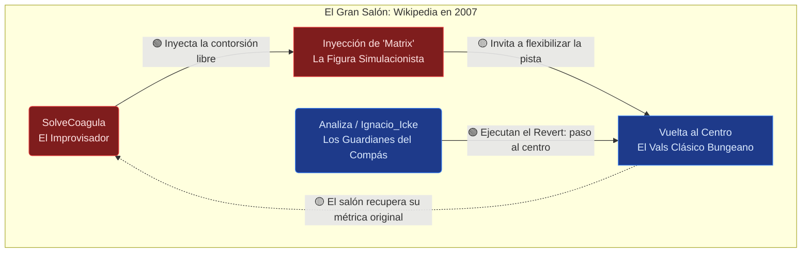

# 💊 Módulo Matrix: La Pastilla Roja Epistemológica

## 1. La Radiografía del Diálogo: La Coreografía Matrix

El "concepto Matrix" no es un debate cinematográfico, es una figura de baile vanguardista que **SolveCoagula** intenta introducir en la pista. El siguiente diagrama ilustra cómo el compás nuevo (el experimento simulacionista) resuena e interactúa con el ritmo tradicional (la comunidad asíncrona).

> [!NOTE]
> **Colores UI ≠ marcas epistemológicas:** las clases CSS `redPill` / `bluePill` en el diagrama son **paleta narrativa** del carrusel. No confundir con 🟢🟡🔴⚪ de [`index-reader.md`](../../index-reader.md).

> 🟢 **[Dato Wiki / Ground Truth]**: La inyección del *thumb* de *Matrix* y el argumento de la simulación de Bostrom/Chalmers existieron de facto en los volcados de octubre.
> 
> 🟡 **[Inferencia Agentchain · `agentchain/composer/block-9.md`]**: El diálogo es rítmicamente asimétrico. SolveCoagula baila buscando expandir los límites espaciales (usando la cultura pop para tensar la filosofía); los compañeros responden no analizando sus saltos (jamás debaten sobre Keanu Reeves), sino restaurando pacientemente el punto cero de la coreografía enciclopédica.

---

## 2. ¿Qué es elegir la "Pastilla Roja" en este contexto?

🔴 **[Deducción del Lector / Generativo]**: 
En la pantalla, la pastilla roja te despierta hacia lo informe; la azul te permite seguir soñando al compás de la máquina.

🟡 **[Inferencia Agentchain · `agentchain/composer/block-9.md` / block-10]**: En esta milonga de 2007:

*   **La Pastilla Azul (El Ritmo Consensuado):** Aceptar la métrica de Mario Bunge. La ciencia es ciencia, la pseudociencia son pasos en falso, la partitura está escrita y el manual de la academia nos evita pisarnos los talones. Es un salón predecible y armónico.
*   **La Pastilla Roja (La Improvisación):** Desplegar 109K bytes de giros anómalos. Introducir a Feyerabend, abrazar a Lakatos, asomarse al problema sin fondo de la demarcación usando *Matrix* como pivote. Implica aceptar que el vals del método científico es una danza fluida, carente de un metrónomo universal absoluto. 

Tomar la pastilla roja significaba **romper la sincronía inquebrantable del artículo** y admitir que todo paso epistemológico pendula sobre el vacío. Las vueltas al centro (los `git revert`) ocurren porque ese baile libre disolvía la trampa rítmica del enciclopedismo en red.

---

## 3. La Guía del Autoestopista Galáctico para SolveCoagula

Si nuestro bailarín fuese un cronista sideral dialogando con las poleas de un autómata gigante, sus cuatro notas íntimas serían:

### I. Antes de entrar a la pista (La Inocencia)
> *"¿Cuán inmensa puede ser la sala de baile antes de que la orquesta cambie a una marcha rígida?"*

🟡 **[Inferencia Agentchain]**: Entró al salón creyendo que sus dimensiones eran infinitas, aptas para sostener cualquier salto de la inteligencia humana mientras no se perdiera el contacto con el suelo de las referencias.

### II. Durante los giros (El Cruce de Piernas)
> *"Si traemos 250 testigos de que podemos bailar fuera de la cuadrícula... ¿por qué el jurado insiste en que volvamos al vals tradicional del primer día?"*

🟡 **[Inferencia Agentchain]**: La revelación durante la sincronía fallida fue comprender que el virtuosismo académico (Cima) carecía del mismo compás que el manual de mantenimiento enciclopédico (Sima). El cuerpo de baile no anhelaba elevación, sino estabilidad grupal.

### III. Después del último paso (El Saludo)
> *"¿Es posible coreografiar la incertidumbre perpetua dentro de un dispositivo ensamblado puramente para la certeza repetible?"*

🟢 **[Dato Wiki]**: El `restore --force` que sella su sesión funciona como un saludo final de inmensa dignidad escénica. Al constatar que el suelo de silicio detesta la asimetría persistente, SolveCoagula detuvo su propia música y se marchó.

### IV. Hoy, contemplando el parqué (El Relámpago)
> *"Si todos los salones de red hoy caminan al unísono maquínico... ¿Tuvo sentido empujarles a improvisar sobre el abismo, o la piedad estaba en dejarles marcar su ritmo seguro?"*

🟡 **[Inferencia Agentchain · `agentchain/composer/block-10.md`]: Vista desde nuestra época de coreografías algorítmicas hiper-polarizadas, aquella voluntad expansiva de 2007 no fue un fracaso: fue un acto espléndido de insolencia, la chispa de intentar que una base de datos aprendiera a soñar el tango de su propia fragilidad.

---

**¿Hacia qué rincón avanzamos?** 
¿Deslizamos los pies por la planimetría cruda de `registro.md` o nos detenemos en el cierre total de la sesión? Envía tu latido.
