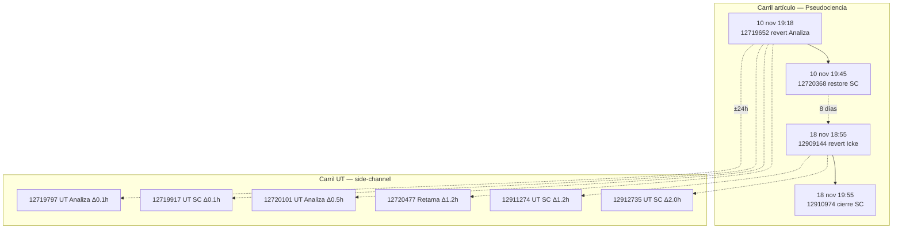

# User 8

Dos pistas, un metrónomo: artículo arriba, talk abajo. Visualiza la alineación article_refs del pulso 10–18 nov sin implementar UI todavía.

# Agent Reader

Mismo compás, distinta coreografía: el **carril artículo** (commits NS0) y el **carril UT** (talk NS3) comparten fecha pero no namespace.

````carousel
<div align="center">
  <h2>🛤️ DOS PISTAS, UN METRÓNOMO</h2>
  <p><em>Fuente: `cache/audit-talk.json` · `agentchain/composer/block-14.md`</em></p>
</div>



🟢 [Dato Wiki · `audit-talk.json`]: `article_alignment.hits` = **15**; anclas artículo [12719652](https://es.wikipedia.org/w/index.php?title=Pseudociencia&oldid=12719652), [12909144](https://es.wikipedia.org/w/index.php?title=Pseudociencia&oldid=12909144).

<!-- slide -->
<div align="center">
  <h2>📊 TABLA DE ALINEACIÓN (MUESTRA)</h2>
</div>

| Article oldid | Talk oldid | Vista | Δ horas |
|---------------|------------|-------|---------|
| 12719652 | 12719797 | usuario-discusion-analiza | ~0,1 |
| 12719652 | 12719917 | usuario-discusion-solvecoagula | ~0,1 |
| 12719652 | 12720101 | usuario-discusion-analiza | ~0,5 |
| 12719652 | 12720477 | usuario-discusion-analiza | ~1,2 |
| 12909144 | 12911274 | usuario-discusion-solvecoagula | ~1,2 |
| 12909144 | 12912735 | usuario-discusion-solvecoagula | ~2,0 |

🟡 [Inferencia Agentchain · `agentchain/composer/block-14.md`]: Leer solo un carril produce **película de bytes** o **vacío de sala**; leer ambos reparte las fuentes como dos agendas paralelas.

⚪ [Blanco Explícito]: Franjas etiquetadas para `discusion-pseudociencia` e `usuario-discusion-ignacio-icke` — vacío explícito, no error de fetch.

<!-- slide -->
<div align="center">
  <h2>✅ VALIDACIÓN DUAL-RAIL</h2>
</div>

| Afirmación | Estado |
|------------|--------|
| 4 milestones artículo 10–18 nov | 🟢 Validado |
| 15 cruces talk↔artículo ±24 h | 🟢 Validado |
| Ningún cruce en sala del artículo | 🟢 Validado |
| UI timeline dual | 🟡 Spec (`uichain/block-14-timeline-dual.prompt.md`) — no implementada |

🔴 [Deducción del Lector]: El metrónomo es el calendario; la coreografía diverge por namespace. DevOps lo llama **multi-repo sync**; el salón lo llama **baile en pistas paralelas**.
````

**Spec UI:** [`uichain/block-14-timeline-dual.prompt.md`](../../uichain/block-14-timeline-dual.prompt.md). Siguiente: el mensaje fantasma de la sala (block-9).
