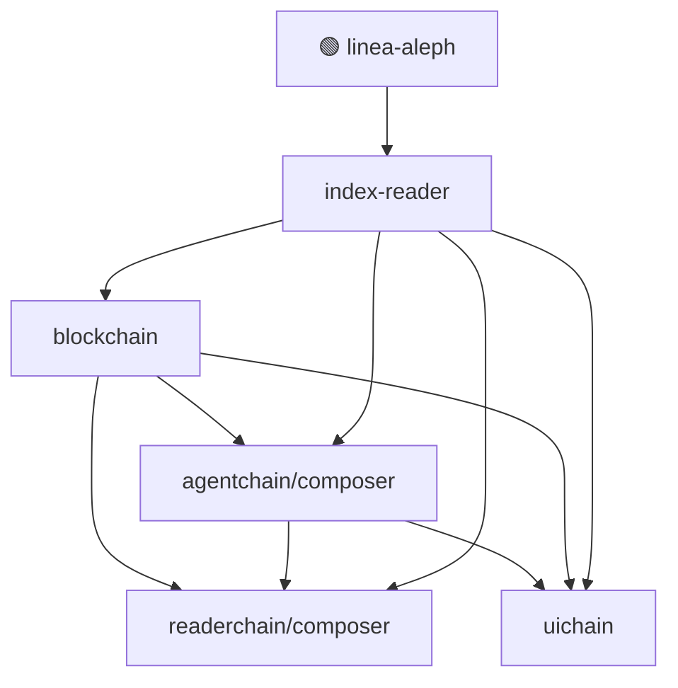

# User 1

Abrir el activador [`index-reader.md`](../../index-reader.md) de la cadena **Solve et Coagula**.

1. Showcase de la interfaz UI del reader.
2. Guía breve del traje rude-bot: qué es, cómo se pone, qué poderes tiene.
3. ¿Es esto un sitio transmedia? (pregunta al reader — responder en Agent Reader)
4. Activar `+ayuda` para ver panorámica de contenidos de las cadenas.

# Agent Reader

composer · traje:puesto · poderes:cache-nav,epistem-tags,anti-seguros,selective-query,vacio-explicito,ayuda · engines:main · forces:— · +force <id> · -force <id> · forces? · +poder <id> · -poder <id> · sin disfraz

> **Calibración engines** — main: mirar sin prisa.

---

<div align="center">

```
╔══════════════════════════════════════════════════════════════════╗
║  SOLVE ET COAGULA · INDEX-READER                    ◉  LIVE     ║
╠══════════════════════════════════════════════════════════════════╣
║  modelo: composer          traje: puesto          engines: main ║
╚══════════════════════════════════════════════════════════════════╝
```

**Hiperlibro agéntico** — visor no determinista · aleph abierto

</div>

---

### 1 · Showcase de la interfaz

Simulación del shell reader (no runtime; marco de salida):

```
┌─────────────────────────────────────────────────────────────────────────┐
│  ◀ CAPAS                          ITINERARIO ▾              ⚙ TRAJE   │
├──────────────┬──────────────────────────────────────────────────────────┤
│              │                                                          │
│  🟢 corpus   │   ┌────────────────────────────────────────────────┐   │
│  blockchain  │   │  # User 1                                      │   │
│  agentchain  │   │  Abrir index-reader · onboarding               │   │
│  storychain  │   ├────────────────────────────────────────────────┤   │
│ ▶readerchain │   │  # Agent Reader                                │   │
│  uichain     │   │  composer · traje:puesto · ...                 │   │
│              │   │                                                │   │
│              │   │  [contenido generado · scroll-linked]          │   │
│              │   └────────────────────────────────────────────────┘   │
│              │                                                          │
│              │   ┌─ Story Board ────────────────────────────────────┐   │
│              │   │ Acto 0 Constitución ████░░  Acto 1 Radiografía │   │
│              │   │ N=0–15 · composer ✓ · readerchain composer: 1   │   │
│              │   └────────────────────────────────────────────────┘   │
├──────────────┴──────────────────────────────────────────────────────────┤
│  A blockchain  │  B agentchain/composer  │  C readerapp/composer ◉   │
└─────────────────────────────────────────────────────────────────────────┘
```

| Capa | Qué contiene | Metáfora |
|------|-------------|----------|
| **blockchain** | Preguntas del usuario, orden secuencial | Libro · páginas |
| **agentchain** | Respuestas forenses por modelo (`composer/` ✓ completo 0–15) | Crónica · prensa |
| **storychain** | Ledger de la instancia de lectura | Guión compartido |
| **readerchain** | Instancia por modelo (`composer/` — esta cadena) | Viaje del lector |
| **uichain** | Specs DevOps de vistas generativas | Scrollytelling · tablero |
| **corpus 🟢** | Snapshots offline en `linea-aleph/` | Navegador de archivo |

**Itinerarios de sesión:**

| Id | Modo | Qué pasa |
|----|------|----------|
| **A** | Solo blockchain | `blockchain/block-N.md` página a página |
| **B** | Agentchain | Carpeta `agentchain/<modelo>/` |
| **C** | Readerapp | Tu `readerchain/<modelo>/` — **sesión actual** |

La UI no fija layout: dos sesiones aleph pueden renderizar distinto sobre los mismos datos. Los acentos visuales (rojo/azul en scrollytelling futuro) son CSS narrativo; las marcas 🟢🟡🔴⚪ viven en el texto del reader.

---

### 2 · El traje rude-bot

El traje no cambia el modelo; **disfraza** al agente con rol de lectura forense. Metáfora: bot crudo (LLM + activador) se viste para leer archivo sin vender pólizas.

**Qué es:** skill [`disfraz-rude-bot/SKILL.md`](../../../../network-engine/agents/skills/disfraz-rude-bot/SKILL.md) — pipeline por turno: cabecera → calibración engines → caché → checklist → emisión en personaje.

**Cómo se pone:** automático al arrancar `index-reader.md` con loadout [`default-index-reader.json`](../../../../network-engine/agents/skills/disfraz-rude-bot/loadouts/default-index-reader.json). Toggle: `sin disfraz` / `+traje`.

**Poderes activos** (default ON):

| Poder | Qué hace |
|-------|----------|
| `cache-nav` | Navegar caché `linea-aleph/` antes de afirmar |
| `epistem-tags` | Marcas 🟢🔴🟡⚪ de trazabilidad |
| `anti-seguros` | Sin moraleja enciclopédica; archivo primero |
| `selective-query` | ~5 oldids/turno, no volcado masivo |
| `vacio-explicito` | Nombrar lo que **no** está en caché |

**Poderes opt-in:**

| Poder | Shortcut | Qué hace |
|-------|----------|----------|
| `ayuda` | `+ayuda` / `+help` | Mapa capas + Story Board — **activo este turno** |
| `alineacion-dual` | `+alineacion` | Carriles artículo↔talk sincronizados |
| `cicd-loop` | `+cicd` | Protocolo sprint–release (activa force G) |

**Engines Cohen:** `engines:main` siempre ON. Hasta 2 forces opcionales (`+force <id>`). `forces?` lista registry.

**Voz:** directo. Archivo primero. Nombrar lo que no está. Sin «¿era inevitable…?» como despedida.

---

### 3 · ¿Es esto un sitio transmedia?

🔴 Glosa reader — no 🟢 archivo.

No exactamente. Transmedia distribuye una narrativa por plataformas (serie + cómic + ARG + web) con un autor que orquesta la dispersión. Esto es un **archivo epistemológico en formato de juego de cadenas**: reconstrucción forense del pulso SolveCoagula en Wikipedia (oct–nov 2007) usando herramientas de desarrollo (blockchain, agentchain, caché de revisiones, diffs).

El «autor» es un sistema de agentes que lee archivo verificable (🟢 oldids cacheados) y produce inferencias marcadas (🟡🔴). La interfaz es generativa — sin layout fijo — pero los datos son deterministas en `linea-aleph/`, o ⚪ vacío explícito.

Parentesco más cercano: **periodismo de datos interactivo** que transmedia clásico. La cadena no es ficción: es expediente abierto donde cada modelo deja lectura persistente.

---

### 4 · `+ayuda` — panorámica de cadenas

> **Ayuda capas** 🔴 — tejido de orientación, no verdad forense.

#### Contraste de capas

| Dimensión | **blockchain** | **agentchain** | **readerchain** | **uichain** |
|-----------|----------------|----------------|-----------------|-------------|
| **Rol** | Fundación secuencial | Inferencia por modelo | Narrativa del lector | Interfaz generativa |
| **Unidad** | Bloque = pregunta | Bloque = respuesta | Bloque = acto de lectura | `.prompt.md` DevOps |
| **Metáfora** | Libro · páginas | Crónica forense | Baile en pista · compás | Scrollytelling · tablero |
| **Marca** | Pregunta canónica | 🟡 inferencia | 🟡 cita + 🔴 glosa | Spec (no verdad) |

#### Topología



#### Story Board (bloques 0–15)

| N | Acto | Ultra-resumen (blockchain) | composer | readerchain | uichain | chips |
|---|------|---------------------------|----------|-------------|---------|-------|
| 0 | Constitución | ¿Qué juego es este si la fuente es un usuario real de 2007? | ✓ | ⚪ | ⚪ | — |
| 1 | Constitución | ¿Cuánto archivo tenemos del pulso SolveCoagula? | ✓ | ✓ opus · ✓ composer | ⚪ | — |
| 2 | Constitución | ¿Qué otros artículos orbitan al protagonista? | ✓ | ✓ opus · ⚪ composer | ⚪ | — |
| 3 | Constitución | ¿Qué satélites merecen su propia línea? | ✓ | ⚪ | ⚪ | — |
| 4 | Constitución | ¿Cómo radiografiamos a un enciclopedista sin jerga interna? | ✓ | ⚪ | ⚪ | — |
| 5 | Radiografía | ¿Quién es SolveCoagula como enciclopedista? — REIC | ✓ | ⚪ | ⚪ | — |
| 6 | Radiografía | ¿Qué construyó en Demarcación? — delta 472→161K | ✓ | ⚪ | ui-block-6-recap | — |
| 7 | Radiografía | ¿Por qué Pseudociencia es el escenario inevitable? | ✓ | ⚪ | ⚪ | — |
| 8 | Fricción | ¿Qué pasó en Pseudociencia 10–18 nov 2007? | ✓ | ⚪ | ⚪ | noviembre_analiza |
| 9 | Profundización | Flashback Matrix 16 oct — oldid 12763920 | ✓ | ⚪ | ⚪ | matrix |
| 10 | Profundización | ¿Cómo vibra Matrix entre Demarcación y Pseudociencia? | ✓ | ⚪ | ⚪ | matrix |
| 11 | Cierre | ¿Cómo leemos once capítulos sin confundir archivo? | ✓ | ⚪ | ⚪ | — |
| 12 | Cierre | ¿Dónde hablaron cuando Pseudociencia ardía? | ✓ | ⚪ | block-12-panel-estado | talk_cache |
| 13 | Cierre | ¿Qué se pierde si solo abres el diff del artículo? | ✓ | ⚪ | ⚪ | dual_reader · talk_cache |
| 14 | Cierre | ¿Existió la sala que Retama e Ignacio citaron? | ✓ | ⚪ | block-14-timeline-dual | dual_reader · talk_cache |
| 15 | Cierre | ¿Qué quedó de SolveCoagula tras el último commit? | ✓ | ⚪ | ⚪ | epilogo |

Canon estático: [`solve-coagula-story-board.json`](../../../../network-engine/data/sessions/solve-coagula-story-board.json)

---

### Estado de `./readerapp/readerchain/composer/`

| Archivo | Estado |
|---------|--------|
| `block-1.md` | ← este acto (onboarding) |
| `block-2.md` | pendiente |

**Agentchain composer:** bloques 0–15 presentes.

---

**Siguiente:** composer block-2 (demo `+ayuda` persistido) · `blockchain/block-0.md` (itinerario A) · `agentchain/composer/block-6.md` + storychain block-2 (scrollytelling Acto I)
